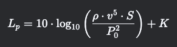

> Проект находится на стади разработки!
> Это расширение для приложения SketchUp. Тестировал только в версии SketchUp2024! 

26.03.25
## Приложение BZ_REDVENT
> Это дополнение к приложению bz_hvac.
> bz_redvent - приложение для подбора щелевых рещёток REDVENT
### Добавление гемов
`require 'active_record'`
`require 'nokogiri'`
`require 'sqlite3'`
`require 'json'`
`require 'open-uri'`
### Добавления расширения в SU
```ruby
module HVAC
    unless file_loaded?(__FILE__)
      # Изменил текущую локальную директорию
      Dir.chdir
      Dir.chdir(Dir.pwd+"/Library/Application Support/SketchUp 2024/SketchUp/Plugins/bz_redvent") 
      # Добавление расширения 
      ENV["REDVENT"] = Dir.pwd
      ex = SketchupExtension.new('Bizzon Hvac RedVent', 'bz_redvent/main')
      ex.description = 'Bizzon Hvac tools: Tools for HVAC'
      ex.version     = '1.0.0'
      ex.copyright   = 'Bizzon © 2023'
      ex.creator     = 'Bizzon'
      Sketchup.register_extension(ex, true)
      file_loaded(__FILE__)
    end
end
```
### Добавление ярлыка tolbox  
> Добавляю через модуль инициолайзера


28.03.25.
## UI

> Разработана в Bootstrap Studio 
> Наименование проекта RedVentUI

### Концепт
UI RedVent предстовляет собой форму опроса, разработаную на основании публичной технической документации, размещённой на странице производителя.

# Расчет падения расхода воздуха в канале

Расчет падения расхода воздуха  в канале при известном сопротивлении на один метр (удельных потерях давления) можно выполнить, используя методы аэродинамики вентиляционных систем.

## Основные формулы и подход

1. **Удельные потери давления (R)** – это потери давления на 1 метр длины воздуховода (Па/м или кгс/м²/м).

2. **Общие потери давления (ΔP)** в прямом участке воздуховода рассчитываются по формуле:<br>
")

где:
- R – удельные потери давления (Па/м),
- L – длина участка (м).

3. **Связь потерь давления с расходом воздуха** определяется по формуле Дарси-Вейсбаха (для круглых воздуховодов):<br>

 
где:
- λ – коэффициент трения,
- D – диаметр воздуховода (м),
- ρ – плотность воздуха (~1,2 кг/м³ при нормальных условиях),
- V – скорость воздуха (м/с).

    Для прямоугольных воздуховодов вместо D используется **эквивалентный диаметр**:<br>


где: 

- a и b – стороны прямоугольного сечения.

4. **Расход воздуха (Q)** связан со скоростью:<br>
")

где: 

- **S** – площадь сечения воздуховода (м²).

## Практический расчет

Если известны:
- **удельное сопротивление R (Па/м)**,

- **длина участка L (м)**,

- **начальный расход Q~1~ (м³/с)**,

то можно определить **падение расхода** из-за потерь давления.

Однако, **расход воздуха в системе зависит от характеристики вентилятора и сети**. Если система работает без вентилятора (естественная вентиляция), то падение расхода можно оценить через баланс давления:<br>


где:

- **ΔP~1~** – исходное давление в системе (до потерь),
- **ΔP=R⋅L** – потери на участке.

Если система с вентилятором, то нужно **учитывать характеристику вентилятора** и построить **совместный график** (сетевую характеристику + характеристику вентилятора).

### Пример расчета
Дано:

- **Удельное сопротивление R=0,5** Па/м,

- **Длина участка L=10** м,

- **Начальный расход Q~1~=1000** м³/ч,

- **Давление вентилятора P~вент~=150** Па.

1. **Общие потери на участке**:

2. **Новое давление в системе**:

3. **Если вентилятор имеет квадратичную характеристику, то**:

**Q~2~≈0,983⋅1000=983 м³/ч**
Таким образом, расход упал на ~1,7%.

### Вывод
Если сопротивление невелико по сравнению с давлением вентилятора, то падение расхода будет небольшим. Для точных расчетов нужно знать характеристику вентилятора и полную сетевую характеристику.

Если у вас есть дополнительные данные (форма воздуховода, скорость, тип вентилятора), можно уточнить расчет.

# Расчет шумовых характеристик щелевого диффузора
Расчет шумовых характеристик щелевого диффузора зависит от скорости воздуха, геометрии щелей и акустических свойств системы

## 1. Основные источники шума в щелевом диффузоре

   - **Турбулентный шум** – возникает из-за вихреобразования при прохождении воздуха через узкие щели.

   - **Резонансные явления** – если щели или полости диффузора создают акустический резонанс.

   - **Виброакустический шум** – если диффузор вибрирует из-за потока.

## 2. Основные формулы и методики оценки
### 2.1. Оценочный расчет уровня звукового давления (Lp)
Уровень шума щелевого диффузора можно оценить по эмпирическим зависимостям. Один из подходов – использование **формулы для шума воздушного потока в решетках и диффузорах**:


где:
- L~p~– уровень звукового давления (дБ),
- ρ – плотность воздуха (~1,2 кг/м³),
- v – скорость воздуха в щели (м/с),
- S – площадь щелей (м²),
- P~0~ – опорное звуковое давление (2·10⁻⁵ Па),
- K – эмпирическая константа (зависит от конструкции, обычно 20–40 дБ).

### 2.2. Упрощенная формула (для практических оценок)

Для щелевых диффузоров часто используют зависимость:


где:
- v – скорость воздуха в щели (м/с),
- S – площадь щелей (м²),
  
**Пример:**
- Скорость в щели v=3 м/с,
- Площадь щелей S=0,01 м².
- 


### 2.3. Корректировка по стандартам (например, VDI 2081, ISO 5135)
Шумовые характеристики диффузоров часто приводятся в каталогах производителей в виде октавных спектров (63 Гц – 8 кГц) в зависимости от скорости.

Если известны **акустические данные диффузора**, можно использовать:


где:
- L~p,ном~  – уровень шума при номинальной скорости v~ном~,
- v – текущая скорость.

## 3. Влияние геометрии щелей на шум
- Узкие щели (менее 5 мм) дают более высокочастотный шум.
- Широкие щели (более 10 мм) – низкочастотный гул.
- Зазоры и неровности увеличивают турбулентность и шум.

## 4. Как снизить шум щелевого диффузора?
- Уменьшить скорость воздуха (оптимально 2–4 м/с в щели).
- Увеличить количество щелей (распределить поток).
- Использовать звукопоглощающие вставки.
- Применить плавные закругления на входе/выходе.

## Вывод
Для точного расчета лучше использовать данные производителя или акустическое моделирование (например, в COMSOL, SolidWorks Flow Simulation). Оценочные формулы дают погрешность ±5 дБ.

# Расчет длины струи воздуха 

Расчет длины струи воздуха от щелевого диффузора до сечения, где скорость снижается до заданных значений (0,2 м/с или 0,5 м/с), выполняется на основе теории свободных изотермических струй. Основные параметры, влияющие на длину струи:

## 1. Основные формулы и подход

Для плоской струи (щелевой диффузор с большой длиной по сравнению с высотой щели) длина струи определяется:

### 1.1. Скорость в струе на расстоянии *x*

Скорость в осевой линии струи убывает по закону:


где:
- *v~x~* – скорость на расстоянии x от щели (м/с),
- *v~0~* – начальная скорость истечения из щели (м/с),
- *b~0~* – начальная ширина щели (м),
- K – коэффициент, зависящий от формы щели (для плоской струи K≈1).

### 1.2. Расстояние x, где скорость падает до *v~x~*

Из формулы выше можно выразить расстояние:​


## 2. Пример расчета

**Дано:**
- Начальная скорость *v~0~* =2 м/с,
- Ширина щели *b~0~* =0,01 м (10 мм),
- Требуется найти расстояние, где *v~x~* =0,5 м/с и *v~x~* =0,2 м/с.

### 2.1. Для *v~x~*=0,5 м/с:


### 2.2. Для *v~x~*=0,2 м/с:


## 3. Учет турбулентности и препятствий

Формула справедлива для **свободной струи** без препятствий. Если есть:
- *Потолок/стены* – струя тормозится быстрее (используются поправочные коэффициенты).
- *Разница температур* – если приточный воздух теплее/холоднее, струя отклоняется.

## 4. Практические рекомендации

- Для комфортной вентиляции скорость на выходе из диффузора обычно 1,5–3 м/с.
- Для точных расчетов лучше использовать CFD-моделирование (например, Ansys Fluent, OpenFOAM).

## Вывод

Длина струи до скорости 0,5 м/с ≈ 15–30 см (при *v~0~* =2–4 м/с),
до 0,2 м/с ≈ 1–2 м.

